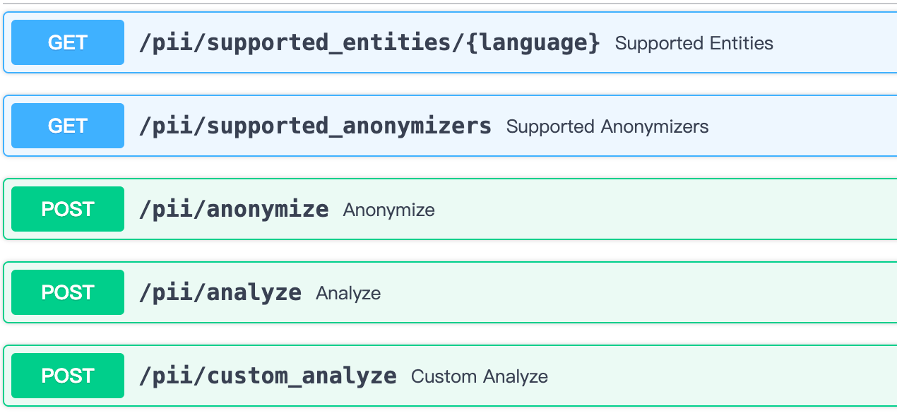

# zh PII
**数据脱敏接口，用于和外部模型交互时保护数据隐私**  
*基于 [Microsoft Presidio](https://github.com/microsoft/presidio) 开发*

## 依赖及部署
- 参照 [Dockerfle](./Dockerfile)
- local
  ```shell
  $ pip3 install -r requirements.txt
  $ python3 -m spacy download zh_core_web_sm
  $ python3 -m spacy download en_core_web_lg
  $ python3 -m spacy download xx_ent_wiki_sm
  $ python3 start_app.py
  ```
  *optional*
  ```shell
  $ cp .env_copy .env
    or
  $ export OPENAI_API_KEY=''
  ```


## 功能描述
### 支持语言
- ['zh', 'en']

### 目前支持分析实体类型
- ['PERSON', 'IBAN_CODE', 'ID_CARD', '''CRYPTO', 'MEDICAL_LICENSE', 'DATE_TIME', 'URL', 'LOCATION', 'PHONE_NUMBER', 'CREDIT_CARD', 'EMAIL_ADDRESS', 'IP_ADDRESS', 'NRP']  
  [类型说明](https://github.com/microsoft/presidio/blob/818c80f9780186b29b09a9489fd3aab00c68c978/docs/supported_entities.md)

### 目前支持隐私操作
- ['replace', 'redact', 'hash', 'mask', 'encrypt']  
  [操作说明](https://github.com/microsoft/presidio/blob/818c80f9780186b29b09a9489fd3aab00c68c978/docs/anonymizer/index.md#built-in-operators)
  
## Todo
- [x] 针对中文优化处理，继承修改 `NlpArtifacts`, `RecognizerRegistry`, `PatternRecognizer`
- [ ] 对已有实体类型针对中文优化或新增中文版本、socre统一
  - [x] 内置`PHONE_NUMBER`实体类型适配中文
  - [ ] 内置`CREDIT_CARD`实体类型适配中文
  - [ ] 内置`MEDICAL_LICENSE`实体类型适配中文
  - [ ] 内置`IBAN_CODE`实体类型适配中文
  - [x] 新增中文`ID_CARD`实体类型
  - [ ] 新增中文`BANK_CARD`实体类型
- [x] 支持自定义关键词实体、自定义`regex`实体
  - [ ] 支持自定义实体与内置实体联合使用
- [x] 支持LLM（openai）对已知隐私部分替换数据合成
- [ ] 支持本地LLM对敏感字段直接提取
- [ ] 支持图片pii提取
- [ ] 基于 [JioNLP](https://github.com/dongrixinyu/JioNLP) 优化  

## 接口参数
- 参照swagger： http://localhost:8080/docs

  
- local test script
  ```shell
  test/presido_case.py
  ```

### get supported entities
```shell
curl -X 'GET' \
  'http://0.0.0.0:8080/pii/supported_entities/zh' \
  -H 'accept: application/json'
```
- response
  ```shell
  {
    "status": 200,
    "msg": "success",
    "data": [
      "URL",
      "PHONE_NUMBER",
      "IP_ADDRESS",
      "CREDIT_CARD",
      "MEDICAL_LICENSE",
      "IBAN_CODE",
      "EMAIL_ADDRESS",
      "NRP",
      "LOCATION",
      "CRYPTO",
      "DATE_TIME",
      "PERSON"
    ]
  }
  ```
  
### get supported anonymizers
```shell
curl -X 'GET' \
  'http://0.0.0.0:8080/pii/supported_anonymizers' \
  -H 'accept: application/json'
```
- response
  ```shell
    {
    "status": 200,
    "msg": "success",
    "data": [
      "replace",
      "redact",
      "hash",
      "mask",
      "encrypt"
    ]
  }
    ```

### text pii analyze
```shell
curl -X 'POST' \
  'http://0.0.0.0:8080/pii/analyze' \
  -H 'accept: application/json' \
  -H 'Content-Type: application/json' \
  -d '{
  "text": "李雷的电话号码是13122832932",
  "lang": "zh",
  "entities": [
    "PHONE_NUMBER", "PERSON"
  ],
  "score_threshold": 0.3,
  "with_anonymize": false,
  "llm_synthesize": false,
  "anonymize_operators": []
}'
```
- response
  ```shell
  {
    "status": 200,
    "msg": "success",
    "data": {
      "analyze": [
        {
          "entity_type": "PERSON",
          "start": 0,
          "end": 2,
          "score": 0.85
        },
        {
          "entity_type": "PHONE_NUMBER",
          "start": 8,
          "end": 19,
          "score": 0.75
        }
      ],
      "anonymize": []
    }
  }
  ```
  
### text pii anonymize
```shell
curl -X 'POST' \
  'http://0.0.0.0:8080/pii/anonymize' \
  -H 'accept: application/json' \
  -H 'Content-Type: application/json' \
  -d '{
  "text": "李雷的电话号码是13122832932",
  "analyzer_results": [
    {
      "entity_type": "PERSON",
      "start": 0,
      "end": 2,
      "score": 0.4
    }
  ],
  "llm_synthesize": false,
  "operators": [
    {
      "entity_type": "PERSON",
      "operator_name": "replace",
      "params": {"new_value": "韩梅梅"}
    }
  ]
}'
```
- response
  ```shell
  {
    "status": 200,
    "msg": "success",
    "data": {
      "text": "韩梅梅的电话号码是13122832932",
      "items": [
        {
          "start": 0,
          "end": 3,
          "entity_type": "PERSON",
          "text": "韩梅梅",
          "operator": "replace"
        }
      ]
    }
  }
  ```
  
### text pii anonymize use llm_synthesize
```shell
curl -X 'POST' \
  'http://0.0.0.0:8080/pii/anonymize' \
  -H 'accept: application/json' \
  -H 'Content-Type: application/json' \
  -d '{
  "text": "李雷的电话号码是13122832932",
  "analyzer_results": [
    {
      "entity_type": "PERSON",
      "start": 0,
      "end": 2,
      "score": 0.4
    }
  ],
  "llm_synthesize": true,
  "operators": []
}'
```
- response
  ```shell
    {
    "status": 200,
    "msg": "success",
    "data": {
      "text": "王磊的电话号码是13122832932",
      "items": []
    }
  }
  ```

### text pii custom analyze
```shell
curl -X 'POST' \
  'http://0.0.0.0:8080/pii/custom_analyze' \
  -H 'accept: application/json' \
  -H 'Content-Type: application/json' \
  -d '{
  "text": "李雷的电话号码是13122832932",
  "lang": "zh",
  "entities": [
    {
      "entity": "abc",
      "deny_list": ["电话", "是"],
      "patterns": [],
      "context": []
    }
  ],
  "with_anonymize": false,
  "llm_synthesize": false,
  "anonymize_operators": [],
  "allow_list": []
}'
```
- response
  ```shell
  {
    "status": 200,
    "msg": "success",
    "data": {
      "analyze": [
        {
          "entity_type": "abc",
          "start": 3,
          "end": 5,
          "score": 1
        },
        {
          "entity_type": "abc",
          "start": 7,
          "end": 8,
          "score": 1
        }
      ],
      "anonymize": []
    }
  }
  ```